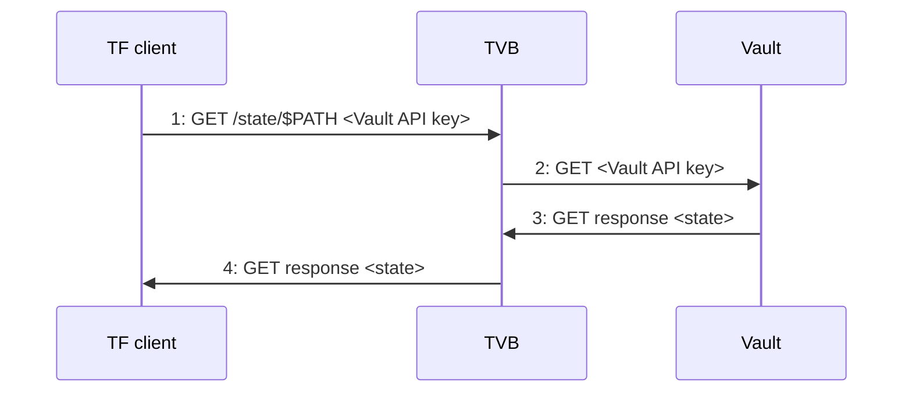
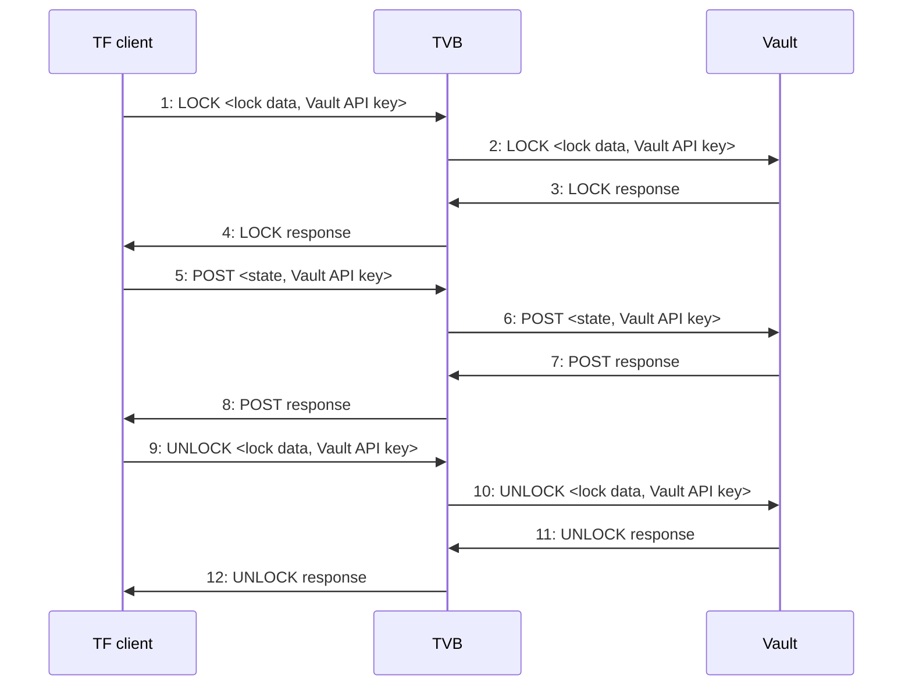

# Terraform Vault Backend Threat Model

## Attacker personas

| Capabilities | Acronym | Exposure |
|--------------|---------|----------|
| Unauthenticated Internet attacker | UIA | High |
| Compromised Network attacker | CNA | Medium |
| Malicious user | MUA | Medium |
| Compromised TVB | CTA | Low |
| Compromised Vault | CVA | Low |

## Assumptions
- Malicious TF state can cause information leaks when used by TF client to deploy an application.
- Vault keys are unique per user and not shared.
- Certificates issued by CAs are trustworthy.
  - If they are not, any use of "proper certificates" can be further secured with certificate pinning.

## Use cases

### UC1: Get State
A Terraform client calls the Terraform Vault Backend to obtain previously stored TF state.

| Use case | Attacker | What | Impact | Exposure | Severity | Countermeasures | Verification |
|----------|----------|------|--------|----------|----------|-----------------|--------------|
| UC1:1 | UIA | DoS server with garbage traffic | Low | High | Medium | Ensure service has sufficient resources to withstand lone attackers | Load test deployment
|||||| Low | Deploy service on internal network or behind DoS protection | Check that deployed IPs belong to known good range
| UC1:1 | UIA | Exhaust server resources using clever tricks like slow loris | Low | High | Medium | Deploy service behind mitigating reverse proxy (nginx, caddy, etc.) | Test that slow lorising deployment fails
|||||| Low | Deploy service on internal network or behind DoS protection | Check that deployed IPs belong to known good range
| UC1:1 | CNA | Impersonate Vault/TVB to obtain Vault API keys | High | Medium | High | Protect traffic with TLS + proper certificates | Test that TVB deployment rejects plain HTTP and uses a non-self signed cert
| UC1:1 | CNA | Eavesdrop on traffic to obtain Vault API keys | High | Medium | High | Enforce TLS on TVB side | Test that TVB deployment rejects plain HTTP
| UC1:1 | UIA, MUA | Impersonate user to obtain secrets from TF state | High | High | High | Use individual Vault API keys | Audit logs for signs of shared keys
|||||| Low | Log accesses with identity and IP | Test that identity and IP is written to log for each request
| UC1:1 | CTA | Obtain and leak Vault API keys | High | Low | High | Ensure dependencies are minimal, trustworthy, and up to date | Use automatic dependency scanning in CI
|||||| Medium | Deploy IDS to increase chance of detection | Test deployment for IDS presence
| UC1:3 | CVA, CNA | Return malicious state to user which steals data from deployment if deployed | High | Medium | High | Protect traffic with TLS + proper certificates | Test that TVB refuses to talk to HTTP or self-signed Vault
| UC1:3 | CNA | Eavesdrop on returned TF state to obtain secrets | High | Medium | High | Protect traffic with TLS | See above
| UC1:3 | CTA | Leak secrets obtained from Vault | High | Low | High | Turn off general egress traffic, ensure dependencies are minimal, trustworthy, and up to date | Use automatic dependency scanning in CI
| UC1:3 | CVA | Return malicious state to user which steals data from deployment if deployed | High | Low | High | Deploy IDS to increase chance of detecting a Vault compromise | Test deployment for IDS presence
| UC1:4 | CNA | Eavesdrop on TF state as it is sent to user to obtain secrets | High | Medium | Medium | Protect traffic with TLS | Test that TVB deployment rejects plain HTTP
| UC1:4 | MUA | Leak secrets to unauthorized third parties | High | Medium | High | Log accesses with identity and IP | Test that identity and IP is written to log for each request
| UC1:4 | CTA | Return malicious state to user which steals data from deployment if deployed | High | Low | High | Ensure dependencies are minimal, trustworthy, and up to date | Use automatic dependency scanning in CI
|||||| Medium | Deploy IDS to increase chance of detection | Test deployment for IDS presence
|||||| Low | Implement gradual rollout and rollback strategy in the service defined by the stored state | Test deploying service with broken state; alerts should fire immediately

## UC2: Safely Update State
A Terraform client locks a particular state, updates it, and then unlocks it.

| Use case | Attacker | What | Impact | Exposure | Severity | Countermeasures | Verification |
|----------|----------|------|--------|----------|----------|-----------------|--------------|
| UC2:1 | MUA | Lock state without intention to ever unlock it. | Low | Medium | Low | Automatically unlock resources after a set timeout | Test that TVB unlocks resource after timeout expires
| UC2:1 | MUA, CTA | Exhaust Vault disk space by writing huge lock data | Low | Medium | Low | ensure dependencies are minimal, trustworthy, and up to date | Use automatic dependency scanning in CI
|||||| Low | Restrict maximum lock data size | Test that TVB rejects writes with too large lock data
| UC2:5 | CNA | Eavesdrop on traffic to obtain secrets from state | High | Medium | High | Use TLS to protect traffic | Test that TVB rejects plain HTTP requests
| UC2:5 | MUA | Exhaust Vault disk space by writing huge state | Low | Medium | Low | Restrict maximum state size | Test that TVB rejects writes with unreasonably large state
| UC2:5 | MUA | Write malicious state to Vault to steal secrets if deployed | High | Medium | High | Scan state for suspicious data | Test that TVB rejects state with suspicious data (e.g. mentions IPs in non-approved ranges)
|||||| Medium | Log accesses with identity and IP | Test that log is updated with identity and IP for all writes
| UC2:6 | CTA | Write malicious state to Vault to steal secrets if deployed | High | Low | High | Ensure dependencies are minimal, trustworthy, and up to date | Use automatic dependency scanning in CI
|||||| Low | Deploy IDS to increase chance of detection | Check deployment for IDS presence
| UC2:6 | CTA | Exhaust disk space by writing huge state | Low | Low | Medium | Ensure dependencies are minimal, trustworthy, and up to date | Use automatic dependency scanning in CI
| UC2:6 | CNA | Eavesdrop on traffic to obtain secrets from state | High | Medium | High | Use TLS + proper certificates to protect traffic | Test that TVB refuses to connect to plain HTTP or self-signed Vault
| UC2:6 | CVA | Leak secrets obtained from state | High | Low | High | Deploy IDS to maximize chance of detecting Vault compromise | Check deployment for IDS presence
